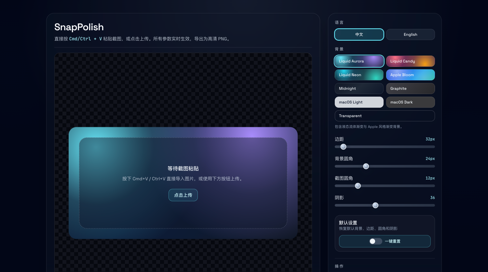

# SnapPolish

**剪贴板优先的截图美化工具，让分享更具质感。**

[English Version](README.md) | [**在线体验**](https://ethantao.github.io/snap-polish/)



## 简介

SnapPolish 是一个轻量级的纯前端工具，旨在瞬间将原始截图转化为精美的视觉大片。它专注于隐私和速度——完全在浏览器中运行，无需上传到服务器。

## 功能特性

- **剪贴板优先**：直接粘贴截图 (`Cmd/Ctrl + V`)。
- **隐私至上**：100% 客户端处理。您的图片永远不会离开您的浏览器。
- **实时定制**：
  - 精美背景预设（流体渐变、Apple 风格等）。
  - 可调节边距、圆角和阴影。
- **高清导出**：
  - 复制为 PNG 到剪贴板（完美适配 Twitter/X, Slack, Notion）。
  - 下载为高清 PNG。
- **轻量级**：零依赖，通过 CDN 加载 Tailwind CSS 和 html2canvas。

## 技术栈

- **HTML5 & 原生 JS** (Vanilla JS)
- **Tailwind CSS** (via CDN)
- **html2canvas** (渲染引擎)

## 使用方法

### 1. 本地运行

直接在浏览器中打开 `index.html` 即可。

> **注意**：为了获得最佳的剪贴板权限体验，建议使用本地服务器（如 `localhost`）而不是 `file://` 协议打开。

```bash
# 使用 npx 和 serve 的示例
npx serve .
```

### 2. 部署

由于这是一个单文件静态 HTML 项目，您可以将其部署在任何地方：

- GitHub Pages
- Vercel
- Netlify

## 开源协议

MIT © [SnapPolish](https://github.com/Ethantao/snap-polish)

Created by [@realYanming](https://x.com/realYanming)
